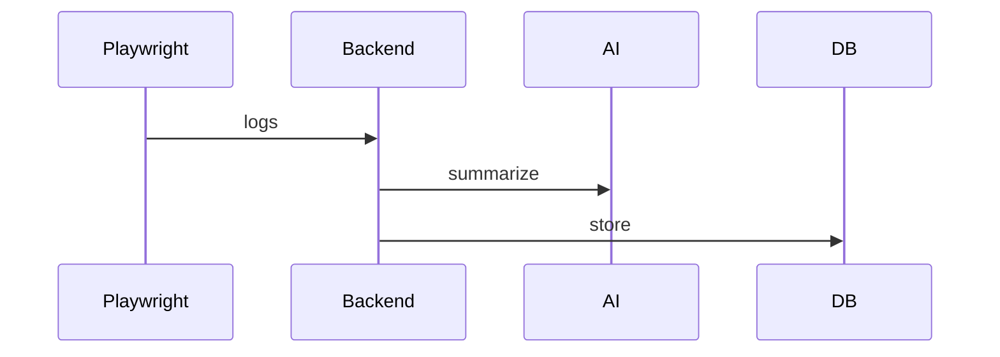

# Backend (Golang)

## Responsibilities
- API
- AI orchestration
- DB interaction

## Flow

```mermaid
sequenceDiagram
Playwright->>Backend: logs
Backend->>AI: summarize
Backend->>DB: store
```

## Example Endpoint
- POST /flows
- GET /search

