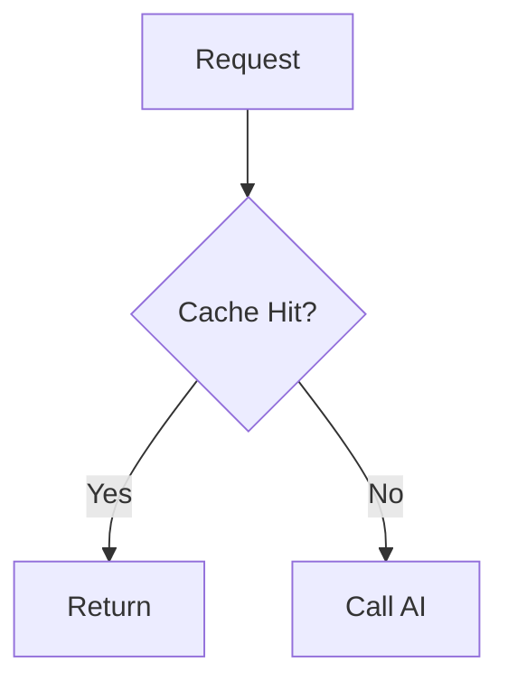

# Cost Optimization

## Strategy
- Cache everything
- Reuse embeddings

## Metrics
- cost per feature
- cache hit rate

## Diagram

```mermaid
flowchart TD
A[Request] --> B{Cache Hit?}
B -->|Yes| C[Return]
B -->|No| D[Call AI]
```
