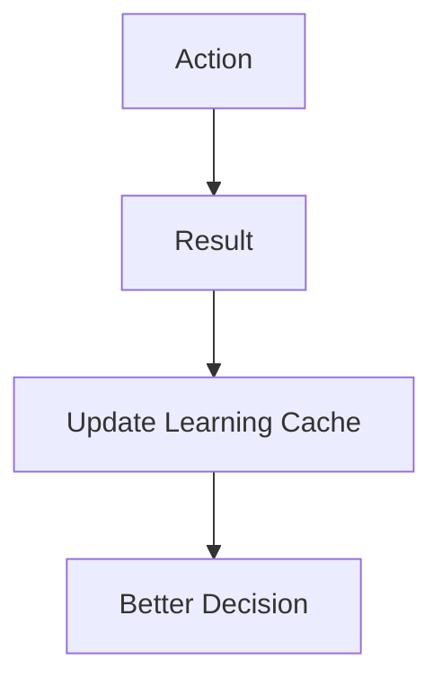

# Learning System

## Evolution
- Random → Guided → Planning

## Flow

```mermaid
flowchart TD
A[Action] --> B[Result]
B --> C[Update Learning Cache]
C --> D[Better Decision]
```

## Key Concepts
- similarity
- success_score
